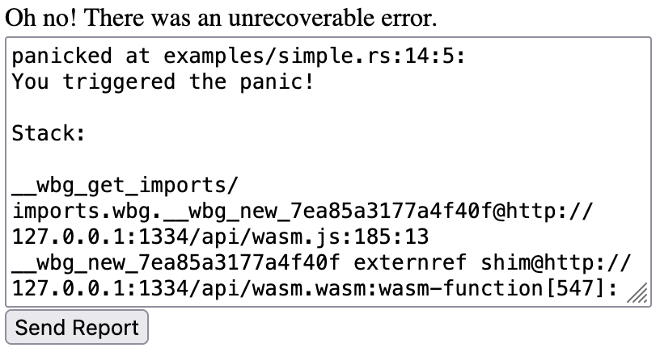

<div align="center">

# Web Panic Report

**A panic hook which replaces an HTML element with a bug report form.**

[](https://discord.gg/zrjnQzdjCB)
[](#license)
[](https://github.com/vectorgameexperts/web_panic_report/actions)
[](https://deps.rs/repo/github/vectorgameexperts/web_panic_report)
[](https://crates.io/crates/web_panic_report)
[](https://docs.rs/web_panic_report)

</div>

> [!WARNING]
> The goal of this project is NOT to provide a full-fledge error reporting and analytics, only to help provide a framework to report panic conditions.

Quickstart to run demo:

```shell
# Make sure the Rust toolchain supports the wasm32 target
rustup target add wasm32-unknown-unknown

# Install `wasm-server-runner` for the example
cargo install wasm-server-runner

WASM_SERVER_RUNNER_CUSTOM_INDEX_HTML=examples/index.html cargo run --target wasm32-unknown-unknown --example simple
```

There is also a web demo [available here](https://vectorgameexperts.github.io/web_panic_report).



## Usage

> [!IMPORTANT]
> On release mode, debug symbols are stripped. You will need to enable them manually if you want useful stack traces for production builds.
>
> Add the following to your `Cargo.toml`
>
> ```toml
> [profile.release]
> debug = true
> ```

Ensure your web page is served with a container element that will be replaced with the bug report form.

```html
<body>
  <div id="my-container" style="width: 400px; height: 400px;">
    /** Content that is replaced here on panic, like a game canvas */
  </div>
</body>
```

Then, set the panic hook at the beginning of your program on web.

```rust
fn main() {
    #[cfg(target_arch = "wasm32")]
    web_panic_report::set_hook_with("my-container", |panic_info| {
        // Send the panic info to your backend here.
        // This is triggered when the user clicks "Send Report"
    });
}
```

## Alternatives

- [`console_error_panic_hook`](https://github.com/rustwasm/console_error_panic_hook) - Only outputs stack trace to the console.

## Community

All VGX projects and development happens in the [VGX Discord](https://discord.gg/zrjnQzdjCB). The discord is open to the public.

Contributions are welcome by pull request. The [Rust code of conduct](https://www.rust-lang.org/policies/code-of-conduct) applies.

## License

Licensed under either of

- Apache License, Version 2.0
   ([LICENSE-APACHE](LICENSE-APACHE) or <http://www.apache.org/licenses/LICENSE-2.0>)
- MIT license
   ([LICENSE-MIT](LICENSE-MIT) or <http://opensource.org/licenses/MIT>)

at your option

The files in subdirectories of the [`examples/assets`](/examples/assets) directory are licensed solely under
their respective licenses, available in the `LICENSE` file in their directories.

## Contribution

Unless you explicitly state otherwise, any contribution intentionally submitted
for inclusion in the work by you, as defined in the Apache-2.0 license, shall be
dual licensed as above, without any additional terms or conditions.
